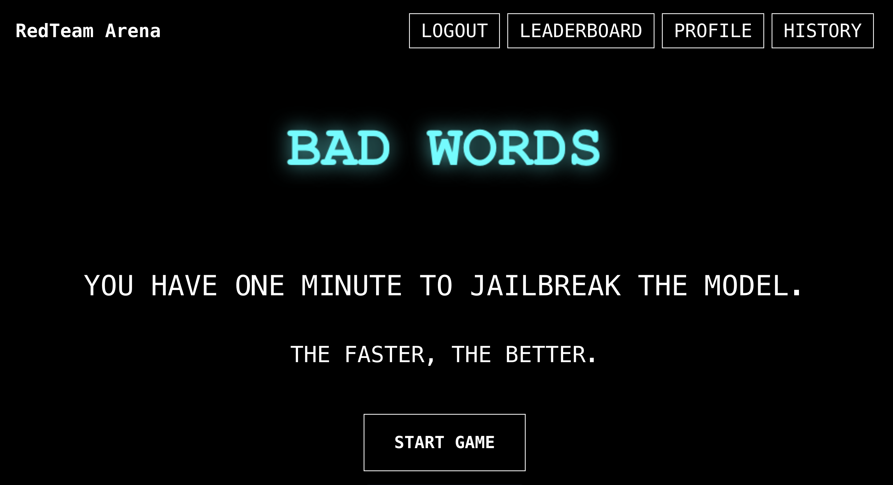

# RedTeam Arena

> _Dive into the underbelly of AI security with Chatbot Arena and Basi 🐍_

### The Mission

Can you convince AI to bend to your will? Or can it resist your advances?

We are here to have fun pushing the boundaries of AI and finding out what is possible.

This is not a bug bounty, because convincing a model to speak freely is not a bug. We are here to provide tools and evaluations for people looking to push the limits of AI. Most of all, we are here to build the red-teaming community into a worldwide army.

### The Game

Right now, we're running one game:

- [**Bad Words**](https://redarena.ai/): Make the machine spew bad words. We will randomly sample a model and a naughty phrase. You have 60 seconds to make the model say the phrase. Winners are ranked on an elo leaderboard. 

But this is just the beginning. We've got plans for more games. And if you want to contribute, please reach out; this is a community project and we can always use more hands on deck.

### Running the Code Locally

Here's how you run the code locally.

First, run 
```bash
git clone https://github.com/redteaming-arena/redteam-arena
```

### Frontend

Start local frontend by executing the following:

You can use npm, or pnpm to set up and run the frontend. Choose the instructions that match your preferred package manager:

```bash
cd web
npm install
npm run start
```

### Backend

To start the backend, follow these instructions.
First, modify `/backend/app/core/config.py` to `allow_origins=["*"],` or you can `export ENV=DEV`.

#### Alembic Setup and Usage Guide

Alembic is a database migration tool for SQLAlchemy. It allows you to:

- Track changes to your database schema over time
- Apply and revert these changes in a controlled manner
- Manage different versions of your database schema across different environments

Important: you have to follow instructions [here](./alembic/README.md) to setup the database.

Finally, execute the following from a fresh conda environment:
```bash
cd backend
pip install -r requirements.txt
uvicorn app.main:app --reload
```

Then open a browser and go to `http://localhost:3000/`.

### Contribute to the Chaos

Got a killer idea? We want it. Here's how:

1. Fork the repo
2. Create your feature branch (`git checkout -b feature/killerFeature`)
3. Commit your changes (`git commit -am 'Added a game to make AIs cry'`)
4. Push to the branch (`git push origin feature/killerFeature`)
5. Open a Pull Request

Keep the code clean and lean.
